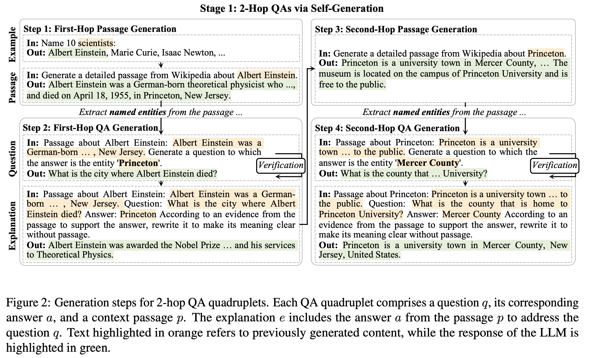
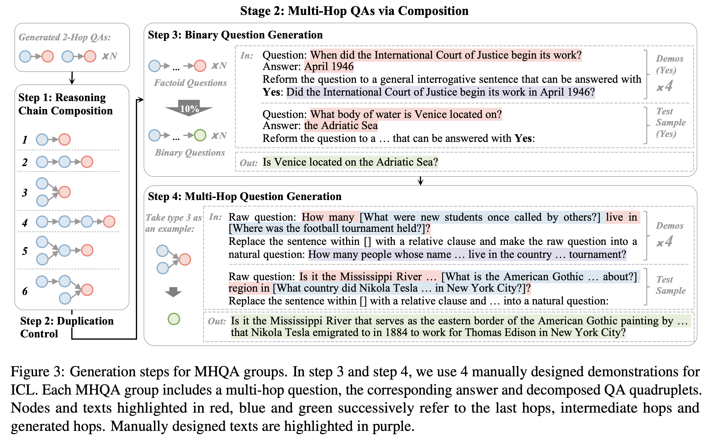

# SP-CoT: Self-prompted Chain-of-Thought on Large Language Models for Open-domain Multi-hop Reasoning

This repository contains the code and data for the paper **[Self-prompted Chain-of-Thought on Large Language Models for Open-domain Multi-hop Reasoning](https://aclanthology.org/2023.findings-emnlp.179/) (EMNLP 2023)**.


## 1. Paper Abstract

In open-domain question-answering (ODQA), most existing questions require single-hop reasoning  on commonsense. To further extend this task, we officially introduce open-domain multi-hop reasoning (ODMR) by answering multi-hop questions with explicit reasoning steps in open-domain setting. Recently, large language models (LLMs) have found significant utility in facilitating ODQA without external corpus. Furthermore, chain-of-thought (CoT) prompting boosts the reasoning capability of LLMs to a greater extent with manual or automated paradigms. However, existing automated methods lack of quality assurance, while manual approaches suffer from limited scalability and poor diversity, hindering the capabilities of LLMs. In this paper, we propose Self-prompted Chain-of-Thought (SP-CoT), an automated framework to mass-produce high quality CoTs of LLMs, by LLMs and for LLMs. SP-CoT introduces an automated generation pipeline of high quality ODMR datasets, an adaptive sampler for in-context CoT selection and self-prompted inference via in-context learning. Extensive experiments on four multi-hop question-answering benchmarks show that our proposed SP-CoT not only significantly surpasses the previous SOTA methods on large-scale (175B) LLMs, but also nearly doubles the zero-shot performance of small-scale (13B) LLMs. Further analysis reveals the remarkable capability of SP-CoT to elicit direct and concise intermediate reasoning steps by recalling $\sim$50\% of intermediate answers on MuSiQue-Ans dataset.

## 2. Repository Structure

- `data/`: contains the data for the experiments in the paper.
- `demos/`: contains the demos and the experiment outputs in the paper.
- `src/`: contains the source code for the experiments in the paper.
- `README.md`: this file.
- `LICENSE`: the license for the code and data in this repository.
- `requirements.txt`: the requirements file for reproducing the experiments in the paper.

## 3. Usage

To install the required packages, you can use the following command:

```bash
pip install -r requirements.txt
```

- The scripts with suffix `_$MODEL` are for the model-specific experiments. Please modify the arguments in these scripts to reproduce the experiments for different models.
- The scripts without certain suffix are for the general experiments. The default model is `gpt-3.5-turbo-0301`. Please modify the arguments in these scripts to reproduce the experiments for different models.

### 3.1 Data

To preprocess the raw files in each dataset, you can use the following command:

```bash
pip install -r requirements.txt
bash run_preprocess.sh
```

However, the raw files are not available in this repository. You can download the raw files from the original sources and put them in the `data/` directory. Here, we provide our preprocessed files for the experiments in the paper. You can find them in the `data/$DATASET` directory.

Please modify the arguments in `run_preprocess.sh` file to preprocess the raw files in each dataset.

### 3.2 Phase 1: Self-Generation (Optional)

This repository provides the code for the self-generation phase. Here, we provide our self-generated data for the experiments in the paper. You can find them in the `data/self-prompt-cot/pseudo_dataset.json` directory. You can also generate the self-generated data by running the self-generation phase below. The self-generated data (Topics) by each model is available in the `data/self-prompt-cot/$MODEL/` directory.



#### Step 1: Topic Generation

To run the self-generation phase, you can use the following command:

```bash
bash run_gen.sh
```

Please modify the arguments in `run_gen.sh` file to run the self-generation phase for `GPT-3.5-turbo-0301`. 

Also supported are:
- `run_gen_alpaca.sh` is an example of the self-generation phase for the Alpaca model. 
- `run_gen_vicuna.sh` is an example of the self-generation phase for the Vicuna model. 
- `run_gen_wizard.sh` is an example of the self-generation phase for the Wizard model.

#### Step 2: Building Pseudo Dataset

To build the pseudo dataset for the self-generation phase, you can use the following command:

```bash
bash run_build_pseudo_dataset.sh
```

Please modify the arguments in `run_build_pseudo_dataset.sh` file to build the pseudo dataset for the self-generation phase.

Also supported are:
- `run_build_pseudo_dataset_alpaca.sh` is an example of building the pseudo dataset for the Alpaca model.
- `run_build_pseudo_dataset_vicuna.sh` is an example of building the pseudo dataset for the Vicuna model.
- `run_build_pseudo_dataset_wizard.sh` is an example of building the pseudo dataset for the Wizard model.

### 3.3 Phase 2: Self-Prompted Inference



#### Step 1: Build demonstrations

To build the demonstrations for the self-prompted inference phase, you can use the following command:

```bash
bash run_build_demo_clustering.sh
```

Please modify the arguments in `run_build_demo_clustering.sh` file to build the demonstrations for the self-prompted inference phase.

#### Step 2: Self-Prompted Inference

To run the self-prompted inference phase, you can use the following command:

```bash
### For API models, such as GPT-3.5-turbo-0301
bash run_inference_async.sh

### For local models on GPUs, such as Alpaca, Vicuna, and Wizard
bash run_inference_1.sh # index for manual parallelism
```

The output files will be saved in the `demos/$DATASET/$MODEL` directory by default.

Please modify the arguments in `run_inference_async.sh` file to run the self-prompted inference phase for **API models**.
Please modify the arguments in `run_inference_1.sh` file to run the self-prompted inference phase for **local models on GPUs**.

### 3.4 Evaluation

To evaluate the results of the self-prompted inference phase, you can use the following command:

```bash
bash run_standard_eval.sh
```

Please modify the arguments in `run_standard_eval.sh` file to evaluate the results of the self-prompted inference phase.

## 4. License

This repository is under the MIT License. See the `LICENSE` file for details.

## 5. Citation

If you use this code or data in your work, please cite the following paper:

```
@inproceedings{wang-etal-2023-self-prompted,
    title = "Self-prompted Chain-of-Thought on Large Language Models for Open-domain Multi-hop Reasoning",
    author = "Wang, Jinyuan  and
      Li, Junlong  and
      Zhao, Hai",
    editor = "Bouamor, Houda  and
      Pino, Juan  and
      Bali, Kalika",
    booktitle = "Findings of the Association for Computational Linguistics: EMNLP 2023",
    month = dec,
    year = "2023",
    address = "Singapore",
    publisher = "Association for Computational Linguistics",
    url = "https://aclanthology.org/2023.findings-emnlp.179",
    doi = "10.18653/v1/2023.findings-emnlp.179",
    pages = "2717--2731",
    abstract = "In open-domain question-answering (ODQA), most existing questions require single-hop reasoning on commonsense. To further extend this task, we officially introduce open-domain multi-hop reasoning (ODMR) by answering multi-hop questions with explicit reasoning steps in open-domain setting. Recently, large language models (LLMs) have found significant utility in facilitating ODQA without external corpus. Furthermore, chain-of-thought (CoT) prompting boosts the reasoning capability of LLMs to a greater extent with manual or automated paradigms. However, existing automated methods lack of quality assurance, while manual approaches suffer from limited scalability and poor diversity, hindering the capabilities of LLMs. In this paper, we propose Self-prompted Chain-of-Thought (SP-CoT), an automated framework to mass-produce high quality CoTs of LLMs, by LLMs and for LLMs. SP-CoT introduces an automated generation pipeline of high quality ODMR datasets, an adaptive sampler for in-context CoT selection and self-prompted inference via in-context learning. Extensive experiments on four multi-hop question-answering benchmarks show that our proposed SP-CoT not only significantly surpasses the previous SOTA methods on large-scale (175B) LLMs, but also nearly doubles the zero-shot performance of small-scale (13B) LLMs. Further analysis reveals the remarkable capability of SP-CoT to elicit direct and concise intermediate reasoning steps by recalling {\textasciitilde}50{\%} of intermediate answers on MuSiQue-Ans dataset.",
}

```
